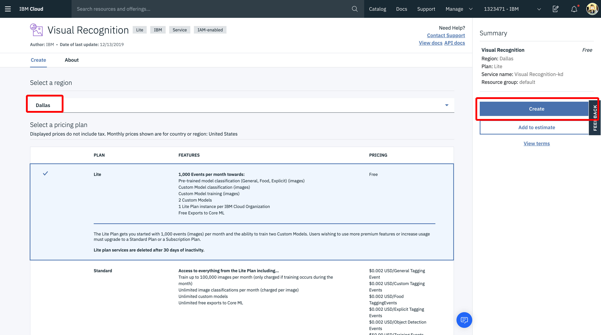
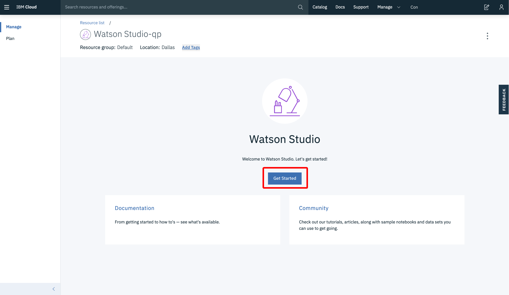
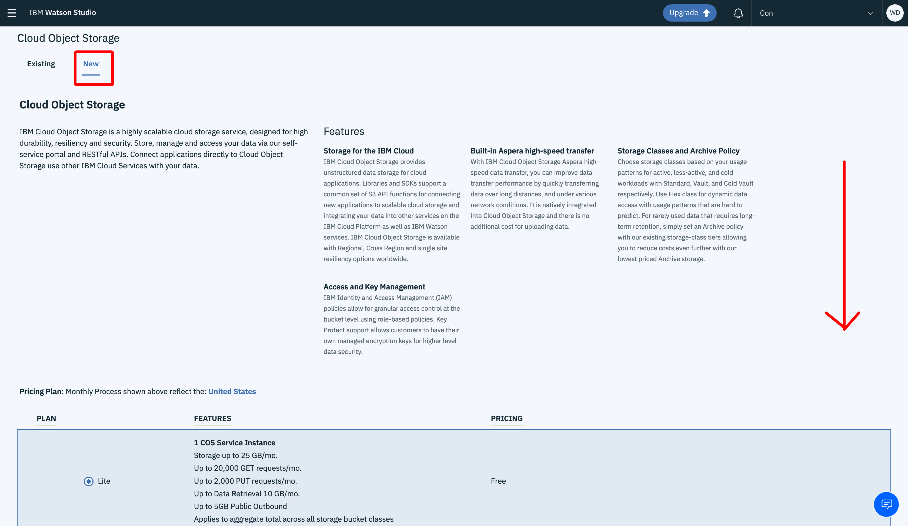
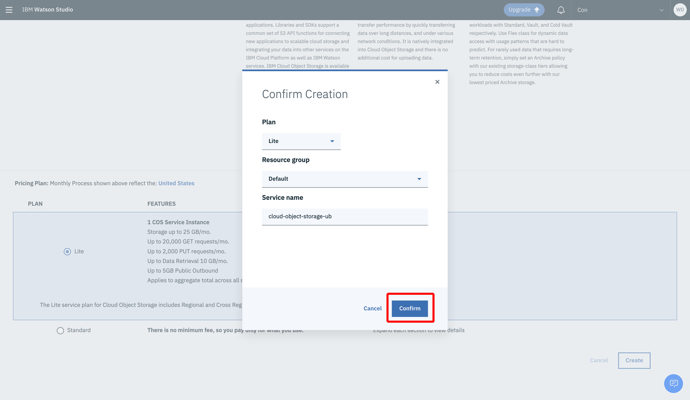
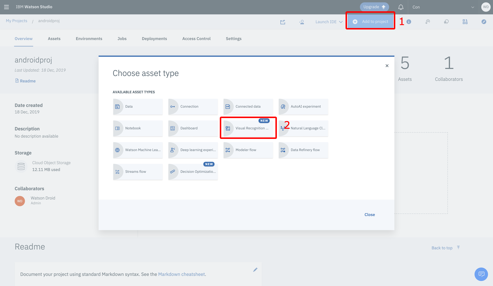
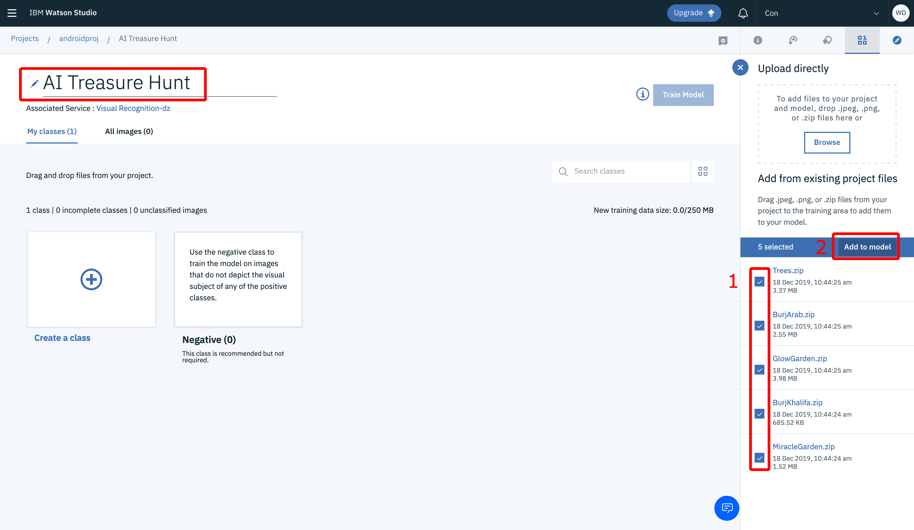
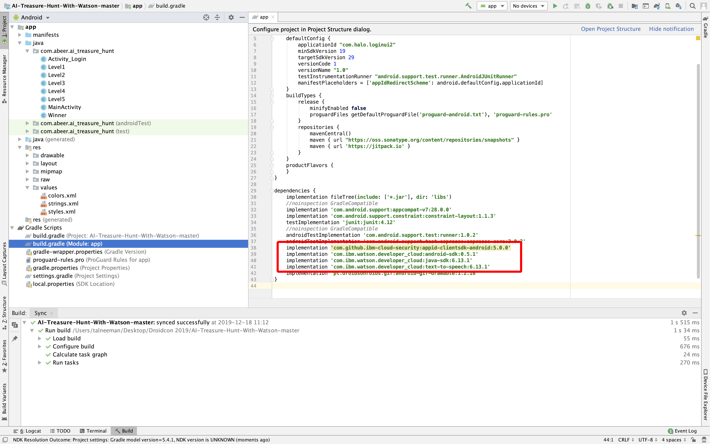
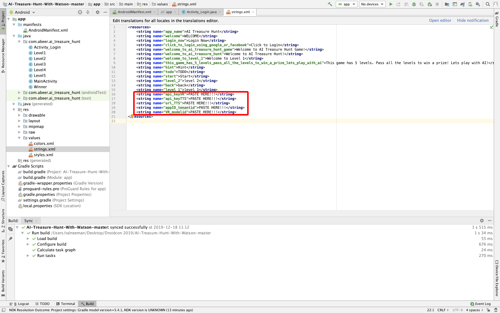
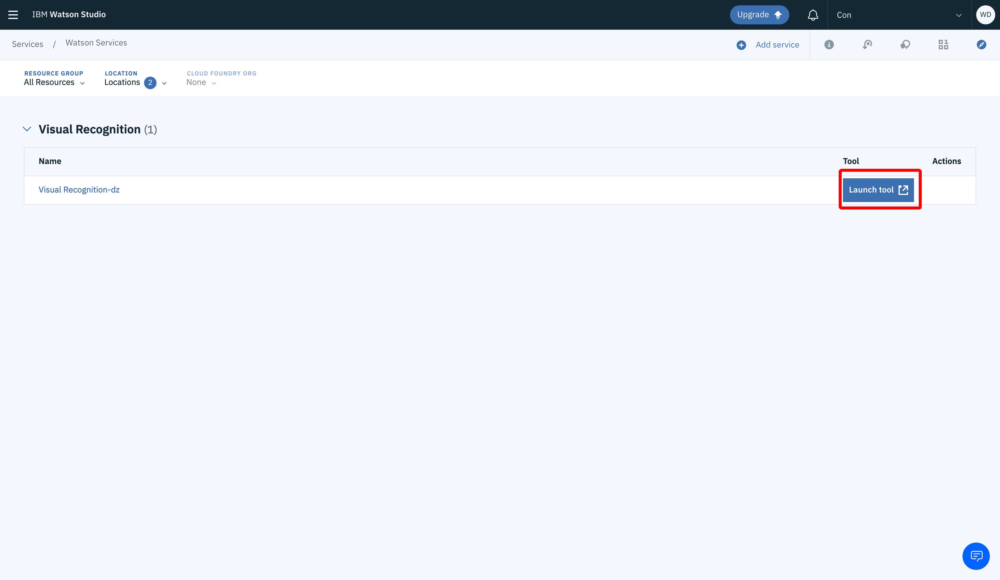
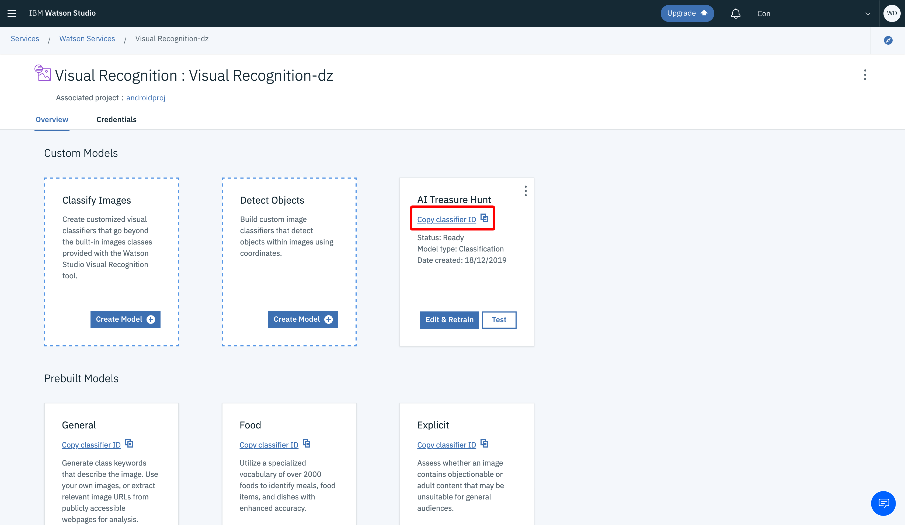

# AI Treasure Hunt Game With Watson

## Learning Objectives
Android Game using IBM Watson Visual Recognition service, Text-to-Speech Service and App ID Service. This is a Treasure Hunt Game, in which the player will be given the hints to find something and take a photo of it to pass a level.  To give the hints, Text-to-Speech Service is used. To determine if the player passes the level, custom visual recognition models are built in Watson Studio with datasets of images. This is integrated within the application. The models are trained with Watson Studio. Furthermore, App ID service is used to add authentication to the game, to track players of the game.

## Demo

#### Login


#### Authentication


#### Level 1: Visual Recognition

 


#### Level Passed

 


## Prerequisites

1. Sign up for an [IBM Cloud account](https://cloud.ibm.com/registration/).
2. Install [Android Studio](https://developer.android.com/studio/)
3. A dataset for the visual recognition model. Use these Sample [Datasets](https://github.com/tal2k4xj/AI-hunt-game/tree/master/datasets) or any dataset of your choice.

## Estimated time

This tutorial takes about 30 minutes to complete if you already have an IBM cloud account set up.

 ## Steps
 
First you set up the services on IBM Cloud. Then you set up the client application.

1. Create an instance of the `Watson Visual Recognition` service and get your credentials:
   - Go to the [Watson Visual Recognition](https://cloud.ibm.com/catalog/services/visual-recognition) page in the IBM Cloud Catalog.
   - Log in to your IBM Cloud account.
   - Click **Create**.
  


   - Go to Manage and copy the `apikey` value.


2. Create an instance of the App ID service and get your credentials:
   - Go to the [App ID](https://cloud.ibm.com/catalog/services/app-id) page in the IBM Cloud Catalog.
   - Make sure the instance will create in London region.
   - Click **Create**.
  

   
   - Click **Service Credentials** > New Credentials > Add
   - Copy the `tenantId` value.
   


3. Create an instance of the Text to Speech service and get your credentials:
   - Go to the [Text-to-Speech](https://cloud.ibm.com/catalog/services/text-to-speech) page in the IBM Cloud Catalog.
   - Click **Create**.
   - Go to Manage and copy the `apikey` value (like in the visual recognition service).
   - Copy the URL too !!!
   
4. Create an instance of the Watson Studio and project to train models:
   - Go to the [Watson Studio](https://cloud.ibm.com/catalog/services/watson-studio) page in the IBM Cloud Catalog.
   - Make sure the instance will create in Dallas region.
   - Click **Create**.




   - Click **Get Started**.

 
    
   - Click **Create a Project** > empty project.
 

 
   - Name the project, Select **Storage** > cloud object storage - click **Add**.
 
   

   - Select **New** scroll down and click **Create**.
 


   - Select **Confirm**.
 


   - Select **Refresh** and you will see the storage you just create, Click **Create**.
 

 
5. Add your Data to train the model :
   - Clone this [repo](https://github.com/tal2k4xj/AI-hunt-game).
   - Select **Find and Add data**.
	


   - Go to the cloned repo and select all the zip files under **datasets** folder


6. Creating Visual Recognition Models 

   - Click **Add to project** and click on the **Visual Recognition**.
  


   - Click **here** to connect this to our Visual Recognition (VR) service we created earlier.
  


   - On **Existing** click on the drop down list and select your VR service then click **Select**.
  


   - Now that you have project associated with the VR service you can create your own model by clickling **Create Model** under Classify Images.
  


   - On the right side you will see all the zip files that you uploaded before, select all of them and click **Add to model**, also give your model a name.
  


   - After you loaded all images you can now Train your model, click on **Train Model** and you can leave this for now and we will come back when it will be ready.
  


## Code
 
**Set up the client application: Android App**

* Start **Android Studio** and **open project**, select the repo you cloned few minutes ago.
* In Android Studio under **Gradle Scripts/build.gradle (Module:app)**. you will see the following dependencies.



We will use them to connect our cloud services (Visual Recognition, App ID, Text to Speech).

**Manifest File**

We added the following permissions to the manifest file:

```xml
    <uses-permission android:name="android.permission.RECORD_AUDIO" />
    <uses-permission android:name="android.permission.INTERNET" />
    <uses-permission android:name="android.permission.WRITE_EXTERNAL_STORAGE" />
    <uses-permission android:name="android.permission.CAMERA" />
```

**App ID Login**

The following code was added in the Activity_Login to implement App ID for user authentication. In this game, we're using this service to track the users of the game since it adds authentication method to the app.

```java
protected void onCreate(Bundle savedInstanceState) {
    super.onCreate(savedInstanceState);
    setContentView(R.layout.activity_login);
    AppID.getInstance().initialize(getApplicationContext(), getString(R.string.appID_tenantid), AppID.REGION_UK);

    rellay1 = (RelativeLayout) findViewById(R.id.rellay1);

    handler.postDelayed(runnable, 2000); //2000 is the timeout for the splash

    btn_login = (Button) findViewById(R.id.btn_login);
    tv_login = (TextView) findViewById(R.id.tv_login);
    t_login = (TextView) findViewById(R.id.t_login);

    //When the button "login" is clicked, call the app ID service for authentication
    btn_login.setOnClickListener(new View.OnClickListener() {
        @Override
        public void onClick(View v) {

            btn_login.setVisibility(View.GONE);
            tv_login.setVisibility(View.GONE);
            t_login.setVisibility(View.VISIBLE);


            LoginWidget loginWidget = AppID.getInstance().getLoginWidget();
            loginWidget.launch(Activity_Login.this, new AuthorizationListener() {
                @Override
                public void onAuthorizationFailure(AuthorizationException exception) {
                    //Exception occurred
                }

                @Override
                public void onAuthorizationCanceled() {
                    //Authentication canceled by the user
                }

                @Override
                public void onAuthorizationSuccess(AccessToken accessToken, IdentityToken identityToken, RefreshToken refreshToken) {
                    //User authenticated

                    //On successful authorization, start the next activity
                    Intent intent = new Intent(Activity_Login.this, MainActivity.class);
                    startActivity(intent);
                }
            });
        }
    });
}
```


**Visual Recognition**

* In level activities, under **onActivityResult** method, The following code was added to implement visual recognition service:

```java
protected void onActivityResult(int requestCode, int resultCode, Intent data) {
    if (requestCode == REQUEST_IMAGE_CAPTURE && resultCode == RESULT_OK) {
        Bundle extras = data.getExtras();
        Bitmap imageBitmap = (Bitmap) extras.get("data");

        //convert to file
        File filesDir = this.getApplicationContext().getFilesDir();
        photoFile = new File(filesDir, "myphoto" + ".jpg");

        OutputStream os;
        try {
            os = new FileOutputStream(photoFile);
            imageBitmap.compress(Bitmap.CompressFormat.JPEG, 100, os);
            os.flush();
            os.close();
        } catch (Exception e) {
            Log.e(getClass().getSimpleName(), "Error writing bitmap", e);
        }

        if (photoFile != null) {
            t_login.setVisibility(View.VISIBLE);
            backgroundThread();
        }
    }
}
```

* In **backgroundThread** method, the following code was added for making the network call, parsing the result from visual recognition service to determine whether to start next activity (Level passed) or not (Level Failed). 

```java
private void backgroundThread(){
    AsyncTask.execute(new Runnable() {
        @Override
        public void run() {
            InputStream imagesStream = null;
            try {
                imagesStream = new FileInputStream(photoFile);
            } catch (FileNotFoundException e) {
                e.printStackTrace();
            }
            ClassifyOptions classifyOptions = new ClassifyOptions.Builder()
                    .imagesFile(imagesStream)
                    .imagesFilename(photoFile.getName())
                    .threshold((float) 0.6)
                    .classifierIds(Arrays.asList("Model Number"))
                    .build();
            ClassifiedImages result = mVisualRecognition.classify(classifyOptions).execute();
            Gson gson = new Gson();
            String json = gson.toJson(result);
            Log.d("json", json);
            String name = null;
            try {
                JSONObject jsonObject = new JSONObject(json);
                JSONArray jsonArray = jsonObject.getJSONArray("images");
                JSONObject jsonObject1 = jsonArray.getJSONObject(0);
                JSONArray jsonArray1 = jsonObject1.getJSONArray("classifiers");
                JSONObject jsonObject2 = jsonArray1.getJSONObject(0);
                JSONArray jsonArray2 = jsonObject2.getJSONArray("classes");
                JSONObject jsonObject3 = jsonArray2.getJSONObject(0);
                name = jsonObject3.getString("class");

            } catch (JSONException e) {
                e.printStackTrace();
            }
            final String finalName = name;
            runOnUiThread(new Runnable() {
                @Override
                public void run() {
                    mTextView.setText("Detected Image: " + finalName);

                    Log.d(TAG, "Ans: " + finalName);

                    if(finalName.equals("Trees")){
                        Intent mass = new Intent(Main2Activity.this, Main3Activity.class);
                        startActivity(mass);
                    }
                    else {
                        Toast toast = Toast.makeText(getApplicationContext(), "Sorry. Try Again!", Toast.LENGTH_LONG);
                        toast.setGravity(Gravity.CENTER_VERTICAL, 0, 0);
                        toast.show();
                    }
                }
            });
        }
    });
}
```

In the above code, the name of the class should be edited in the following condition in the place of Trees, depending on the names of classes you added in the visual recognition model.

```java
if(finalName.equals("Trees")){
    Intent mass = new Intent(Main2Activity.this, Main3Activity.class);
    startActivity(mass);
}
                        
```
**Text-to-Speech**

* In level activities, the following code was added to implement Text-to-Speech service:

```java
public void speakhint() {
    IamOptions options = new IamOptions.Builder()
            .apiKey(getString(R.string.api_keyTTS))
            .build();
    textToSpeech = new TextToSpeech(options);
	
    //Add the url from service credentials
    textToSpeech.setEndPoint("add url here");

    new SynthesisTask().execute(hint);
}
private class SynthesisTask extends AsyncTask<String, Void, String> {
    @Override
    protected String doInBackground(String... params) {
        SynthesizeOptions synthesizeOptions = new SynthesizeOptions.Builder()
                .text(params[0])
                .voice(speakLanguage)
                .accept(SynthesizeOptions.Accept.AUDIO_WAV)
                .build();
        player.playStream(textToSpeech.synthesize(synthesizeOptions).execute());
        return "Did synthesize";
    }
}
```

**Credentials**

* To add all the credentials you copied go to the `strings.xml` and paste them in the right place :



* You still miss one more this before you can run the application and this is the **Model ID / Classifier ID**, to get that you can back to your project : https://dataplatform.cloud.ibm.com/

* Click on the Navigation menu, under Services select **Watson services**.


* Click **Launch tool**.



* **Copy classifier ID** and paste it in the `VR_modelid` in the strings.xml.



#### Architecture


## Summary
This tutorial introduced visual recognition models by showing how to build a fun treasure hunt game. You started by creating services on the IBM Cloud platform. Then you built the application on the client side and there you have it!

## References

You can use Android SDK to use other IBM Watson services in your android app at: https://github.com/watson-developer-cloud/android-sdk

Do more with App ID: https://github.com/ibm-cloud-security/appid-clientsdk-android

Developing an image classifier: https://github.com/sudoalgorithm/Developing-A-Image-Classifier-Using-Watson-Visual-Recognition-On-Watson-Studio


## Contributors

[Kunal Malhotra](https://github.com/sudoalgorithm) 

[Ayush Maan](https://github.com/ayushmaan6) 

[Anchal Bhalla](https://github.com/anchalbhalla/) 


